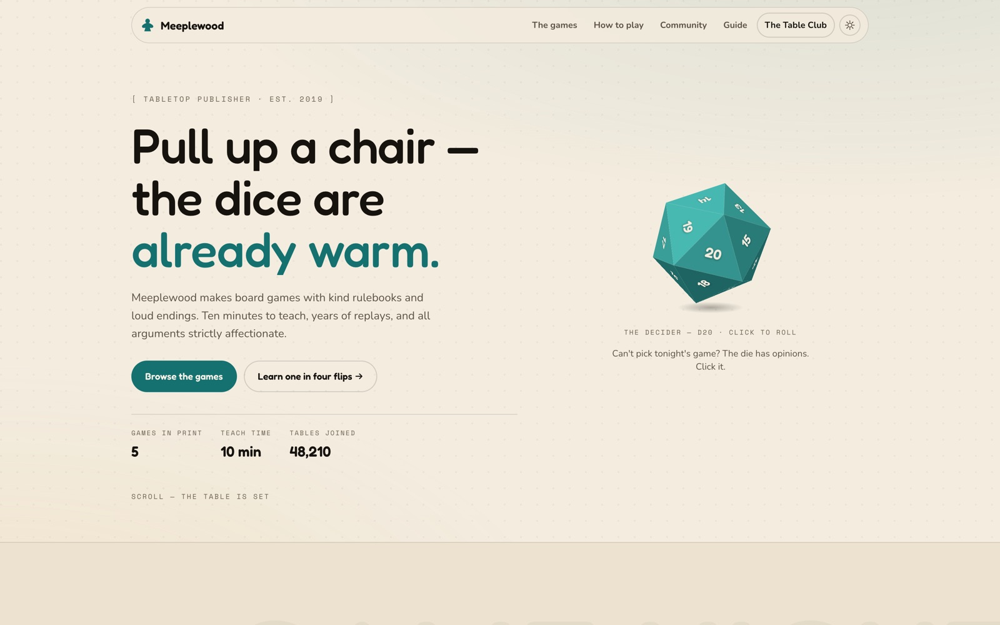

<!-- parable:beautified -->
<div align="center">

<h1>Meeplewood</h1>

<p><strong>Tabletop publisher — click a tumbling 3D-CSS d20 to pick game night, then learn the rules in a page-flip book.</strong></p>

<p>
  <a href="https://bswxyz.github.io/meeplewood/"></a>
  
  
  <a href="LICENSE"></a>
</p>

<p>
  <a href="https://bswxyz.github.io/meeplewood/"><b>Live demo</b></a>
  &nbsp;·&nbsp;
  <a href="https://bswxyz.github.io/meeplewood/guide/">Build notes</a>
  &nbsp;·&nbsp;
  <a href="https://parable-three.vercel.app/templates">More templates</a>
</p>

<a href="https://bswxyz.github.io/meeplewood/">
  
</a>

</div>

**Use this template** — copy the source into a new project:

```bash
npx degit bswxyz/meeplewood my-app
```


Board games for the good kind of noise. A design-showcase website template for a fictional
tabletop publisher — kind rulebooks, loud endings, and a d20 that decides what you play tonight.

Part of **Parable**, a curated set of individually-crafted website templates.
Read the full build story at [`/guide/`](./src/routes/guide/+page.svelte).

## Concept

Every game night starts with the same argument: *what do we play?* Meeplewood's hero settles it —
**a real d20 built from twenty `<div>`s** (icosahedron math → one `matrix3d` per face) that tumbles
on click via quaternions and lands on a "what to play" suggestion. The second signature is the
how-to-play section: the entire Hollowpine rulebook as a **CSS 3D page-flip book**, four spreads,
because a publisher that brags about kind rulebooks should prove it.

## Design system

- **Palette** — light (default): linen `#f3ecdf` on board-night ink `#16130f`; dark: flipped.
  Accent jewel-teal `#1f8a8a` family, secondary amber `#e0a13a`. Box art keeps fixed "print"
  colours in both themes so the shelf reads as ink, not UI.
- **Type** — Fredoka (display) · Nunito (body) · Space Mono (table-talk metadata).
- **Signature ease** — `--ease: cubic-bezier(.26, 1.5, .38, .96)` — *"settle"*, the last wobble of
  a die coming to rest. Shared by buttons, reveals and the roll's final slerp.
- **Themes** — flip on `:root[data-theme="light|dark"]`, toggled in the nav, persisted to
  `localStorage` (`meeplewood-theme`), bootstrapped inline in `<head>` before first paint.

## Stack

SvelteKit + `@sveltejs/adapter-static`, Svelte 5 (runes), Vite. Fully prerendered — no server, no
runtime dependencies, no 3D library, no image files (all art is inline SVG / CSS 3D). Reveals and
hidden intro states are gated behind a `.js` class, so the page reads fully without JavaScript;
`prefers-reduced-motion` gets a static die (that still answers on click) and instant page-swaps.

## Run locally

```bash
npm install
npm run dev        # dev server at /
npm run build      # prerenders into docs/ with base path /meeplewood
npm run preview    # serve the production build
```

## Structure

```
src/
├── app.html                 .js gate + theme bootstrap + fonts
├── app.css                  design tokens (both themes) + shared scaffolding
├── lib/
│   ├── DiceRoller.svelte    signature #1 — the d20 (matrix3d + quaternions)
│   ├── Rulebook.svelte      signature #2 — the page-flip rulebook
│   ├── ThemeToggle.svelte   light/dark toggle
│   └── reveal.js            scroll reveals + counters (one Svelte action)
└── routes/
    ├── +page.svelte         the site
    └── guide/+page.svelte   "How Meeplewood was built"
static/.nojekyll             keeps GitHub Pages from mangling _app/
```

## Demo vs. real

This is a design showcase. The publisher, the games, the Table Club pricing and the fox are all
fiction. The RSVP form **validates and confirms in place but sends nothing** — wire it to your own
endpoint (Formspree, a serverless function, a mailer) before promising anyone a chair. The tier
buttons link back to the demo form; there is no checkout.

## License

MIT — see [LICENSE](./LICENSE).
